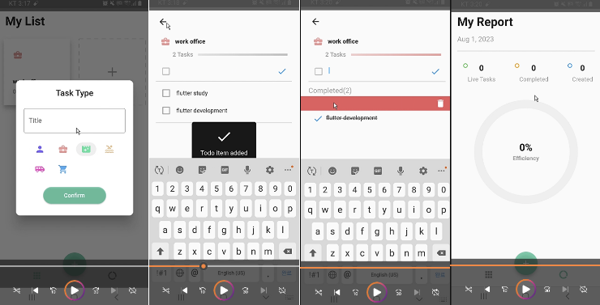

# GetToDo
### GetX Statement Todo Application

## 프로젝트 요약
 
> 2023.04.17 - 2023.04.24   
 
> **Flutter 개인 프로젝트**
* GetX 상태관리를 활용하여 만들어 본 todo 어플리케이션입니다.
* Task CURD 구현을 위하여 'lib/home/controller' 에 CRUD 기능이 포함되어 있는 메소드를 추가
* dotted_border 카드 위젯을 사용
* step_progress_indicator 패키지를 사용하여 현재 할 일의 진도가 어느 정도인지를 UI로 나타냄
 

## Dependency
- `dotted_border`:  <a target="_blank" href="https://pub.dev/packages/dotted_border">https://pub.dev/packages/dotted_border</a>
- `equatable`: <a target="_blank" href="https://pub.dev/packages/equatable">https://pub.dev/packages/equatable</a>
- `flutter_easyloading`: <a target="_blank" href="https://pub.dev/packages/flutter_easyloading">https://pub.dev/packages/flutter_easyloading</a>
- `get`:  <a target="_blank" href="https://pub.dev/packages/get">https://pub.dev/packages/get</a>
- `get_storage`: <a target="_blank" href="https://pub.dev/packages/get_storage">https://pub.dev/packages/get_storage/http</a>
- `intl`: <a target="_blank" href="https://pub.dev/packages/intl"https://pub.dev/packages/intl</a>
- `step_progress_indicator`: <a target="_blank" href="https://pub.dev/packages/step_progress_indicator">https://pub.dev/packages/step_progress_indicator</a>

## 시연영상
https://youtu.be/JIkdfyKFCjk
